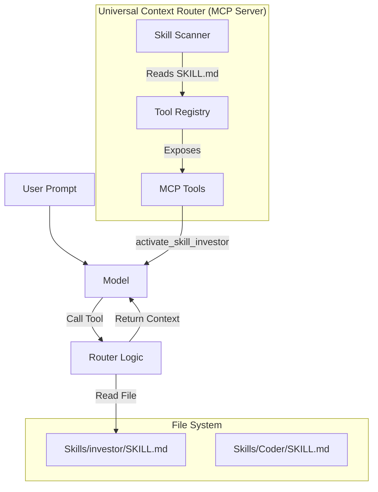

# Universal MCP Context Router Design

## The Problem
-   **Claude Code** uses a proprietary client-side engine to parse `USE WHEN` lines in local files and inject context.
-   **Gemini/Qwen/Antigravity** rely on standard **Tool calling** (via MCP) and do not scan local files for proprietary intent syntax.

## The Solution: "Dynamic Tool Registry"
Instead of relying on a client to parse text files, we build an **MCP Server** that does the parsing and exposes the Skills as **standard Tools**.

### Architecture



## How It Works (Step-by-Step)

### 1. Server Startup (The Scanner)
When the MCP server starts, it scans your `PAI/Skills/` directory.
-   It reads every `SKILL.md`.
-   It extracts the `name` (e.g., "investor") and `description` (the "USE WHEN" clause).
-   **Key Magic**: It converts that English description into an MCP Tool Definition.

**Input (SKILL.md):**
```yaml
name: Investor
description: USE WHEN user wants to analyze stock options or trade paper money.
```

**Output (MCP Tool Definition):**
```json
{
  "name": "activate_skill_investor",
  "description": "ACTIVATES the investor skill. Use this when user wants to analyze stock options or trade paper money.",
  "inputSchema": { "type": "object", "properties": {} }
}
```

### 2. The Trigger (Universal Support)
-   **Gemini/Qwen**: They see `activate_skill_investor` as just another tool (like a calculator). If the user asks "Check Apple stock", the model semantically matches the description and calls the tool.
-   **Claude**: Claude *also* sees this tool. Even though it *could* use its native `USE WHEN` parser, using the tool is equally valid (and often more reliable because it's explicit).

### 3. The Execution (Context Injection)
When the model calls `activate_skill_investor()`:
1.  The MCP Server receives the request.
2.  It reads the full content of `Skills/investor/SKILL.md`.
3.  It wraps it in a system prompt XML block (e.g., `<loaded_context>...</loaded_context>`).
4.  It returns this text as the "Tool Result".

### 4. The Result
The model sees the tool result (the huge context file) and immediately "learns" the skill. It can then answer the user's question using that new knowledge.

## Why This Supports "Antigravity/Claude" Too
This approach is **additive**.
-   **Claude Code** can keep its native behavior (if you want), OR you can disable it and rely on this server.
-   **Antigravity** (assuming it supports MCP) will just see tools.
-   **Gemini/Qwen** see tools.

It creates a **Standardized Interface** (MCP Tools) for what was previously a **Proprietary Interface** (regex text scanning).

## Implementation Sketch (TypeScript)

```typescript
// map-skills-to-tools.ts
import { ListToolsRequest, CallToolRequest } from "@modelcontextprotocol/sdk/types";

// 1. DYNAMIC TOOL GENERATION
async function listTools(): Promise<ListToolsRequest.Result> {
  const skills = await scanSkillsDirectory(); // Reads your PAI/Skills folder
  
  return {
    tools: skills.map(skill => ({
      name: `activate_skill_${skill.name.toLowerCase()}`,
      description: skill.useWhenDescription, // The text from "USE WHEN..."
      inputSchema: { type: "object", properties: {} }
    }))
  };
}

// 2. CONTEXT LOADING
async function callTool(req: CallToolRequest) {
    const skillName = req.params.name.replace("activate_skill_", "");
    const content = await readSkillFile(skillName);
    
    return {
        content: [{
            type: "text",
            text: `<system-context source="${skillName}">\n${content}\n</system-context>`
        }]
    };
}
```

## Migration Steps for YOU
1.  **Keep your files**: Don't delete `SKILL.md`.
2.  **Create the Server**: Build this simple MCP server (approx. 100 lines of TS).
3.  **Connect**: Add this server to your Gemini/Qwen config.
4.  **Result**: You now have "Progressive Context Loading" on any AI model that supports Function Calling.
