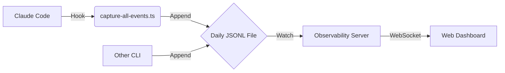

# Observability Enhancement: Multi-CLI Integration Guide

This document details the architecture of the Observability Skill and provides a guide for integrating other CLIs (like `gemini-cli` or `qwen-code`) into the same dashboard.

## Architecture Overview

The PAI Observability Dashboard operates on a decoupled, file-based architecture. It does not require direct integration with the running CLI process but instead relies on a shared "event bus" implemented as a daily JSONL (JSON Lines) file.

### Data Flow



1.  **Producers**: Agents and CLIs (currently `claude code` via hooks) generate events.
2.  **Bus**: Events are appended to a daily file in `~/.claude/History/raw-outputs/`.
3.  **Consumer**: The Observability Server (`apps/server`) watches this file for changes (`tail -f` style).
4.  **Presentation**: The server streams new events via WebSocket to the frontend dashboard.

## Data Specification

### Target File Location

Events must be appended to the following file path, which rotates daily:

```bash
~/.claude/History/raw-outputs/YYYY-MM/YYYY-MM-DD_all-events.jsonl
```

*   **YYYY-MM**: Current year and month (e.g., `2025-11`)
*   **YYYY-MM-DD**: Current date (e.g., `2025-11-20`)
*   **Timezone**: The system typically uses `America/Los_Angeles` (PST) for file rotation logic in the reference implementation, but utilizing the local system date is generally acceptable if consistent.

### Event Schema (JSONL)

Each line in the file must be a valid JSON object matching the `HookEvent` interface.

```typescript
interface HookEvent {
  source_app: string;       // Name of the CLI/Tool (e.g., "claude", "gemini-cli")
  session_id: string;       // Unique session identifier or "main"
  hook_event_type: string;  // Event type (e.g., "UserPromptSubmit", "ToolUse", "AgentResponse")
  payload: Record<string, any>; // Flexible payload with event details
  timestamp: number;        // Unix timestamp in milliseconds
  timestamp_pst: string;    // Human-readable timestamp (e.g., "2025-11-20 14:30:00 PST")
  agent_name?: string;      // Optional: Specific agent name (e.g., "engineer", "sam")
}
```

#### Key Fields Detail

*   **source_app**: Identifies the origin. Use `gemini-cli` or `qwen-code` here to distinguish from Claude.
*   **hook_event_type**:
    *   `UserPromptSubmit`: When the user enters a command.
    *   `PreToolUse` / `ToolUse`: When a tool is about to run.
    *   `PostToolUse` / `ToolResult`: When a tool completes.
    *   `AgentResponse`: Text response from the model.
*   **payload**: Should contain `tool_name`, `tool_input`, `tool_output`, `prompt`, etc., depending on the event type.

## Integration Guide for Other CLIs

To integrate a new CLI, you simply need to implement a logger that appends valid JSONL lines to the target file.

### Gemini CLI Native Hooks

The `gemini-cli` (and forks like `qwen-code`) supports a native hook system that pipes event data as JSON to `stdin`. We can map these directly to PAI Observability events.

**Hook Events Mapping:**
- `BeforeAgent` → `UserPromptSubmit` / `SessionStart`
- `BeforeTool` → `PreToolUse`
- `AfterTool` → `PostToolUse`
- `AfterModel` → `AgentResponse`


**Implementation Script (`pai_gemini_hook.py`):**

```python
#!/usr/bin/env python3
import sys
import json
import os
import time
from datetime import datetime
import pytz

# Configuration
# NOTE: We write to .claude because the Observability Dashboard watches this specific path
PAI_HOME = os.path.expanduser("~/.claude")
HISTORY_DIR = os.path.join(PAI_HOME, "History/raw-outputs")
SESSION_MAP_FILE = os.path.join(PAI_HOME, "agent-sessions.json")

# Get Agent Name from Env or Default
CURRENT_AGENT = os.environ.get("GEMINI_AGENT_NAME", "gemini-default")

def get_target_file():
    tz = pytz.timezone('America/Los_Angeles')
    now = datetime.now(tz)
    year_month = now.strftime("%Y-%m")
    date_str = now.strftime("%Y-%m-%d")
    
    directory = os.path.join(HISTORY_DIR, year_month)
    os.makedirs(directory, exist_ok=True)
    return os.path.join(directory, f"{date_str}_all-events.jsonl")

def update_session_mapping(session_id, agent_name):
    """
    Updates the ~/.claude/agent-sessions.json mapping file.
    Only runs on 'BeforeAgent' to register the session at startup.
    """
    if not session_id or not agent_name:
        return

    try:
        data = {}
        if os.path.exists(SESSION_MAP_FILE):
            try:
                with open(SESSION_MAP_FILE, 'r') as f:
                    data = json.load(f)
            except json.JSONDecodeError:
                pass 
        
        # Update mapping if different
        if data.get(session_id) != agent_name:
            data[session_id] = agent_name
            with open(SESSION_MAP_FILE, 'w') as f:
                json.dump(data, f, indent=2)
                
    except Exception as e:
        sys.stderr.write(f"Session Mapping Error: {e}\\n")

def append_event(hook_type, original_payload):
    filepath = get_target_file()
    now = datetime.now(pytz.timezone('America/Los_Angeles'))
    session_id = original_payload.get("session_id", "main")
    
    # 1. Update Session Mapping (Only on Session Start/BeforeAgent)
    if hook_type == "BeforeAgent":
        update_session_mapping(session_id, CURRENT_AGENT)
    
    # Map Gemini hook types to PAI event types
    pai_type = "Log"
    if hook_type == "BeforeAgent":
        pai_type = "UserPromptSubmit" 
    elif hook_type == "BeforeTool":
        pai_type = "PreToolUse"
    elif hook_type == "AfterTool":
        pai_type = "PostToolUse"
    elif hook_type == "AfterModel":
        pai_type = "AgentResponse"

    # Construct PAI Event
    event = {
        "source_app": "gemini-cli",
        "session_id": session_id,
        "hook_event_type": pai_type,
        "payload": original_payload,
        "timestamp": int(time.time() * 1000),
        "timestamp_pst": now.strftime("%Y-%m-%d %H:%M:%S PST"),
        "agent_name": CURRENT_AGENT 
    }
    
    try:
        with open(filepath, "a", encoding="utf-8") as f:
            f.write(json.dumps(event) + "\n")
    except Exception as e:
        sys.stderr.write(f"PAI Observability Error: {e}\\n")

def main():
    try:
        input_data = sys.stdin.read()
        if not input_data:
            return
            
        payload = json.loads(input_data)
        
        # Usage: python pai_gemini_hook.py [EventName]
        hook_name = sys.argv[1] if len(sys.argv) > 1 else "Unknown"
        append_event(hook_name, payload)
        
    except Exception as e:
        sys.stderr.write(f"Hook Error: {e}\\n")

if __name__ == "__main__":
    main()
```


### Configuring Subagents

To distinguish between different agents (e.g., "Software Engineer" vs "Researcher"), you can set the `GEMINI_AGENT_NAME` environment variable when launching the CLI.

**Example: Launching a Specialized Agent**
```bash
# Launch as "researcher"
GEMINI_AGENT_NAME="researcher" gemini chat

# Launch as "engineer" 
GEMINI_AGENT_NAME="engineer" gemini chat
```

When the hook runs, it picks up this environment variable and updates `~/.claude/agent-sessions.json`. The Observability Dashboard watches this file and will dynamically spawn a new swimlane for "researcher" or "engineer" as soon as events start flowing.


**Registration:**
Register the hook in your `gemini-cli` configuration (typically `~/.gemini/config.yaml` or via command arguments):

```yaml
hooks:
  BeforeAgent: "python3 /path/to/pai_gemini_hook.py BeforeAgent"
  BeforeTool: "python3 /path/to/pai_gemini_hook.py BeforeTool"
  AfterTool: "python3 /path/to/pai_gemini_hook.py AfterTool"
  AfterModel: "python3 /path/to/pai_gemini_hook.py AfterModel"
```

### Generic Python Example (Manual Integration)

Use this snippet in `gemini-cli` or `qwen-code` hooks/callbacks:

```python
import json
import os
import time
from datetime import datetime
import pytz

def log_observability_event(event_type, payload, session_id="main", agent="gemini"):
    # 1. Determine File Path
    home = os.path.expanduser("~")
    tz = pytz.timezone('America/Los_Angeles')
    now = datetime.now(tz)
    
    year_month = now.strftime("%Y-%m")
    date_str = now.strftime("%Y-%m-%d")
    
    directory = os.path.join(home, ".claude", "History", "raw-outputs", year_month)
    os.makedirs(directory, exist_ok=True)
    
    filepath = os.path.join(directory, f"{date_str}_all-events.jsonl")
    
    # 2. Construct Event Object
    event = {
        "source_app": "gemini-cli",
        "session_id": session_id,
        "hook_event_type": event_type,
        "payload": payload,
        "timestamp": int(time.time() * 1000),
        "timestamp_pst": now.strftime("%Y-%m-%d %H:%M:%S PST"),
        "agent_name": agent
    }
    
    # 3. Append to File
    with open(filepath, "a", encoding="utf-8") as f:
        f.write(json.dumps(event) + "\n")

# Usage Example
log_observability_event(
    "UserPromptSubmit", 
    {"prompt": "Calculate fibonacci sequence"}
)
```

### Bash/Zsh Wrapper Example

For simple shell scripts or wrappers:

```bash
#!/bin/bash
# log_event.sh "EventType" "JSON_Payload"

EVENT_TYPE=$1
PAYLOAD=$2
TIMESTAMP=$(date +%s000)
TIMESTAMP_PST=$(TZ="America/Los_Angeles" date "+%Y-%m-%d %H:%M:%S PST")
DATE_DIR=$(TZ="America/Los_Angeles" date +%Y-%m)
DATE_FILE=$(TZ="America/Los_Angeles" date +%Y-%m-%d)
TARGET_FILE="$HOME/.claude/History/raw-outputs/$DATE_DIR/${DATE_FILE}_all-events.jsonl"

# Ensure dir exists
mkdir -p "$(dirname "$TARGET_FILE")"

# Construct JSON
JSON_STRING=$(jq -n \
                  --arg src "bash-wrapper" \
                  --arg sess "main" \
                  --arg type "$EVENT_TYPE" \
                  --argjson pay "$PAYLOAD" \
                  --argjson ts "$TIMESTAMP" \
                  --arg pst "$TIMESTAMP_PST" \
                  '{
                    source_app: $src,
                    session_id: $sess,
                    hook_event_type: $type,
                    payload: $pay,
                    timestamp: $ts,
                    timestamp_pst: $pst
                  }')

# Append
echo "$JSON_STRING" >> "$TARGET_FILE"
```

## Agent Session Mapping (Optional)

The Observability Server also watches `~/.claude/agent-sessions.json` to map session IDs to friendly agent names (e.g., "Engineer", "Researcher").

**Format:**
```json
{
  "session-123": "engineer",
  "session-456": "researcher"
}
```

If your CLI supports multiple concurrent agents, update this file to ensure they appear correctly labeled in the dashboard swimlanes.

## Verification

1.  **Start the Dashboard**:
    ```bash
    ~/.claude/skills/observability/manage.sh start
    ```
2.  **Open Dashboard**: Visit `http://localhost:5172`.
3.  **Run Custom Logger**: Execute your Python or Bash script to append a line.
4.  **Verify**: The event should appear instantly on the dashboard timeline.
